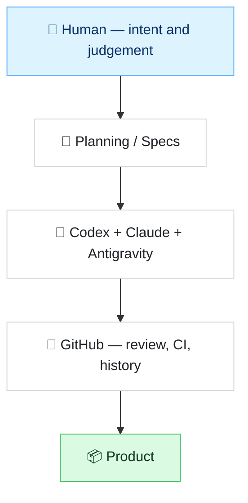

# Hi 👋 I'm Tien Trung Nguyen

**Software Developer from Vietnam 🇻🇳**

Building practical mobile and backend applications with **Flutter** and **.NET**,
while going deeper into **AI engineering**, **multi-agent systems** and **developer tooling**.

---

## 🧭 About Me

|  |  |
| :-- | :-- |
| **Building** | Flutter and .NET applications |
| **Focused on** | AI engineering, multi-agent systems, agent orchestration |
| **Learning** | AI applications, advanced cloud architecture, and Rust |
| **Interested in** | C#, Python, and mobile development |
| **Based in** | Vietnam |
| **Reach me at** | [tientrungnguyen.1706@gmail.com](mailto:tientrungnguyen.1706@gmail.com) |

---

## 🚀 Currently Building

A repeatable pipeline for turning intent into shipped software — a human decides what
*done* means, agents do the work in parallel, and GitHub stays the source of truth.

**Focus areas**

- **AI Engineering** — model-backed features, prompt and context design, evaluation loops
- **Multi-Agent Systems** — several specialised agents cooperating on one task
- **Agent Orchestration** — planning, hand-off, verification, and merge discipline
- **Developer Tooling** — the glue that makes the loop above fast and repeatable

---

## 🤖 AI Engineering

How I actually work with models day to day — spec first, agents second, verification always.

| Stage | What happens |
| :-- | :-- |
| **Spec** | Constraints and acceptance criteria are written *before* any agent touches code |
| **Fan-out** | Codex, Claude, and Antigravity work the same spec from different angles |
| **Verify** | Every result is diffed, built, and tested — agent output is a proposal, not a merge |
| **Tooling** | Small internal tools keep the loop repeatable instead of ad-hoc |

---

## 🧱 Tech Stack

**Languages**

**Frameworks and web**

**Data and tooling**

**Exploring**

Also working with **SQL Server**, **GitHub Actions**, and **Android** / **Windows** tooling.

---

## 📊 GitHub Analytics

Every number above is pulled live from the GitHub API — nothing here is hand-written.

<!--
  Language breakdown cards. Enable these once there are public code repositories to
  summarise; today they render "There are no repos to show", so they are held back
  rather than shipped as a broken-looking card:

  
  
-->

---

## 🐍 Contribution Snake

<picture>
  <source media="(prefers-color-scheme: dark)" srcset="https://raw.githubusercontent.com/tientrungnguyen1706/tientrungnguyen1706/output/github-snake-dark.svg" />
  <source media="(prefers-color-scheme: light)" srcset="https://raw.githubusercontent.com/tientrungnguyen1706/tientrungnguyen1706/output/github-snake.svg" />
  
</picture>

Regenerated daily by <a href=".github/workflows/snake.yml"><code>.github/workflows/snake.yml</code></a>. The light variant is the primary one.

---

## 💥 A Normal Day in the Multi-Agent Loop

Original animated SVG, drawn by hand — no third-party GIFs, no JavaScript.

---

## 📈 Development Activity

When the commits actually happen, in UTC+7.

---

## 📬 Contact

Happy to talk about **Flutter**, **.NET**, **C#**, **Python**, and mobile development —
or about **AI engineering**, **multi-agent systems**, and **developer tooling**.

---

Specs in, agents out, merge conflicts inevitable. · Built in Vietnam 🇻🇳

